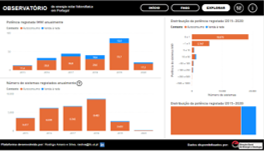
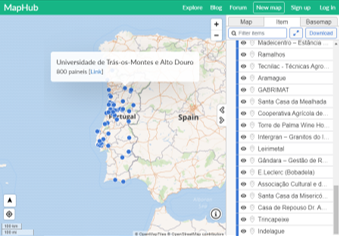

<!-- # Energy Commons -->
<!--  **Tools and Information Database for the science, engineering, economics and politics of the Energy Transition** -->

<!--Repository and open database for tutorials, computational tools, software implementions, technical documents, research papers, books and articles on the various aspects of the ongoing energy transition.-->

<!--Repositorio e base de dados aberta para tutoriais, ferramentas computacionais, economia e poltica da Transição Energética-->

# Observatório de energia solar fotovoltaica em Portugal

### <a href="https://app.powerbi.com/view?r=eyJrIjoiNTY0MDgxZWQtOGZhMi00ZWVkLTgwYjMtOTk2ZGIzY2QyMGFlIiwidCI6IjBiZmE4NTAwLWIxZjItNDU2Ni1iYWYxLTZmNTkzNzA4OTNlNyIsImMiOjh9&pageName=ReportSection3aef81d4ad9a6bde8430" target="_blank">Dashboard (colaboração DGEG)</a>
Análise aos registos de instalações fotovoltaicas da Direção Geral de Energia e Geologia (DGEG).
Estes registos estão desagregados ao nível mensal (tempo) e NUTSIII (espaço).   
De momento apenas estão abrangidas Unidades de Pequena Produção e sistemas para autoconsumo.   

  

### [Projetos fotovoltaicos nos *media*](projetos-fotovoltaicos-media.md)
Conteúdo disponível em meios de comunicação tradicionais, páginas web de empresas do setor, Facebook e LinkedIn.    

### [Mapeamento de projetos fotovoltaicos](https://maphub.net/rasilva/mapa-de-instalacoes-de-autoconsumo-fotovoltaico)
Georreferenciação de projetos identificados na secção anterior. 
Apesar de menos completo que os registos da DGEG, oferece maior detalhe (em termos de localização e aplicação).  

  

### [Materiais variados sobre energia fotovoltaica](materiais-variados.md)
Textos, webinars, seminários e conferências de divulgação e discussão, quer portugueses ou internacionais.
De momento é apenas abrangido o tema do autoconsumo coletivo e comunidades energéticas. 
   

### [Legislação e regulamentos](legislacao-regulamentos.md)
Documentação preparada pelo Governo Português ou instituições qualificadas (DGEG, ERSE).
De momento é apenas considerado o tema do autoconsumo e as comunidades de Energia.
