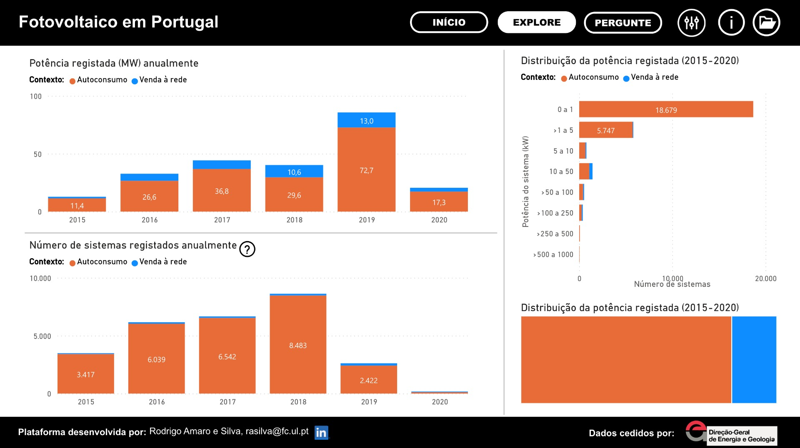
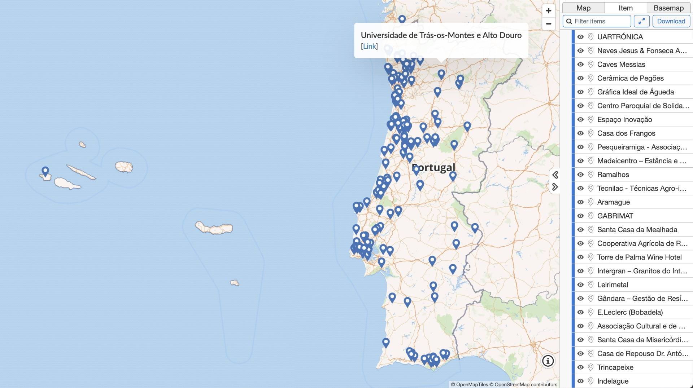

<!-- # Energy Commons -->
<!--  **Tools and Information Database for the science, engineering, economics and politics of the Energy Transition** -->

<!--Repository and open database for tutorials, computational tools, software implementions, technical documents, research papers, books and articles on the various aspects of the ongoing energy transition.-->

<!--Repositorio e base de dados aberta para tutoriais, ferramentas computacionais, economia e poltica da Transição Energética-->

# Observatório de energia solar fotovoltaica em Portugal

Siga a <a href="www.linkedin.com/company/observatorio-fotovoltaico" target="_blank">página de LinkedIn do Observatório</a> e esteja a par de novidades.
 
Qualquer sugestão ou pergunta, enviar e-mail para rasilva@fc.ul.pt
 

### <a href="https://app.powerbi.com/view?r=eyJrIjoiZjUxODBmMzUtMzM1Zi00YTlhLWE0YWItMjI2ZmM0NjRkNmJmIiwidCI6IjBiZmE4NTAwLWIxZjItNDU2Ni1iYWYxLTZmNTkzNzA4OTNlNyIsImMiOjh9" target="_blank">Dashboard: fotovoltaico em Portugal</a>
Quanta capacidade fotovoltaica já foi instalada em Portugal? Quais as regiões com maior presença desta tecnologia? Esta plataforma de visualização procura responder a estas e outras perguntas explorando e divulgando, através de um repositório de acesso aberto, os registos de instalações fotovoltaicas em Portugal.

Estes registos foram cedidos pela Direção Geral de Energia e Geologia (DGEG) estando, de momento, apenas abrangidas Unidades de Pequena Produção (UPP) e unidades para autoconsumo.  

  

### <a href="http://energy-commons.com/projetos-fotovoltaicos-media.html" target="_blank">Projetos fotovoltaicos nos *media*</a>
Tem ideia de quanta informação sobre projetos de produção fotovoltaica conseguimos encontrar nos meios de comunicação tradicionais, páginas web de empresas do setor, Facebook ou LinkedIn? Venha descobrir! 

### <a href="http://energy-commons.com/mapa-projetos-fotovoltaicos.html" target="_blank">Mapeamento de projetos fotovoltaicos</a>
Este mapa complementa a informação representada no dashboard, oferecendo maior detalhe espacial e descritivo de algumas das instalações fotovoltaicas encontradas nos media. Leu alguma notícia sobre uma instalação? Partilhe connosco e ajude-nos a enriquecer o mapa!

  

### <a href="http://energy-commons.com/materiais-variados.html" target="_blank">Recursos vários  sobre energia fotovoltaica</a>
Quer saber mais sobre energia solar fotovoltaica? Venha consultar artigos e materiais multimédia, quer portugueses ou internacionais.
De momento é apenas abrangido o tema do autoconsumo coletivo e comunidades energéticas. 
   

### <a href="http://energy-commons.com/legislacao-regulamentos.html" target="_blank">Legislação e regulamentos</a>
Quer conhecer as leis e regulamentos que regem a produção de energia solar fotovoltaica em Portugal? Encontre aqui documentação preparada pelo Governo Português ou instituições qualificadas (DGEG, ERSE). 
De momento é apenas considerado o tema do autoconsumo e as comunidades de Energia.
